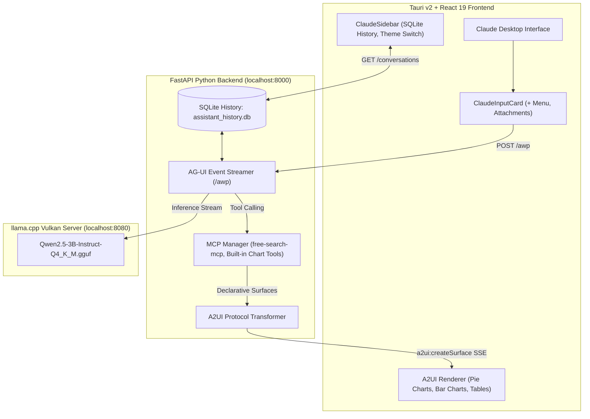

# AI Assistant — Portable Offline Edge Agent

A private, local-first desktop AI assistant designed for edge devices. Features a **Claude-inspired SaaS interface**, **generative UI (A2UI)**, **Model Context Protocol (MCP)** tool execution, and local GPU-accelerated LLM inference with zero cloud dependency.

---

## 🌟 Highlights

- **100% Local & Private:** Runs entirely on-device using quantized edge models (`Qwen2.5-3B-Instruct-Q4_K_M`) via Vulkan GPU acceleration.
- **Claude SaaS Aesthetic:** Refined interface inspired by Claude Desktop, featuring:
  - Dynamic time-based greeting with terracotta sunburst glyph (*"Up late, Harsh?"* / *"Good evening, Harsh"*).
  - Collapsible left sidebar with real-time SQLite conversation history (*Chats and tasks*).
  - Floating prompt card with attachment file previews, tool switches, and edge model status.
- **Generative UI (A2UI Protocol):** Instead of raw text or JSON dumps, tools and models emit declarative UI surfaces:
  - **Interactive Pie Charts:** `<PieChartCard />` with donut styling, glowing highlights, and hover tooltips.
  - **Interactive Bar Charts:** `<BarChartCard />` for category comparisons.
  - **Sortable Data Tables:** `<DataTable />` with automatic markdown table rendering.
  - **Search Grounding Cards:** `<SearchResultsCard />` with source count and snippets.
- **Adaptive Context Window & 4-Step Overflow Defense:**
  - Auto-detects device physical RAM at startup to allocate `-c 2048` (≤4 GB) up to `-c 16384` (16+ GB).
  - 4-step overflow defense: Detects context limits, auto-prunes chat history FIFO, retries silently, and provides friendly edge-device fallbacks without showing raw errors.
- **MCP Tool Integration:** Connects seamlessly to standard Model Context Protocol servers (e.g., `free-search-mcp` for grounded web searches).
- **Direct Export System:** Exports threads to `.md`, `.json`, or `.txt` directly into the Windows `Downloads` folder, complete with a one-click *"Show in Folder"* Explorer shortcut.
- **Dual-Theme Engine:** Toggle between **Claude Warm Light** (linen canvas `#FAF9F5`, terracotta accents) and **Claude Charcoal Dark** (`#141413`).

---

## 🏗️ Architecture



---

## 🚀 Getting Started

### Prerequisites
- **Node.js:** v18+ and `npm`
- **Rust & Cargo:** Latest stable toolchain
- **Python:** 3.10+ (for backend)
- **GPU (Optional but recommended):** Vulkan-compatible GPU for acceleration

### 1. Clone & Install Dependencies
```bash
# Clone the repository
git clone https://github.com/your-repo/ai-portable-app.git
cd ai-portable-app

# Install frontend dependencies
npm install
```

### 2. Set Up Backend Virtual Environment
```bash
cd backend
python -m venv .venv
.venv\Scripts\activate
pip install -r requirements.txt
cd ..
```

### 3. Run in Development Mode
```bash
# Terminal 1: Start local llama-server
llama-server -m models/Qwen2.5-3B-Instruct-Q4_K_M.gguf -c 4096 --port 8080 --jinja

# Terminal 2: Start FastAPI backend
cd backend
.venv\Scripts\uvicorn main:app --host 127.0.0.1 --port 8000 --reload

# Terminal 3: Launch Tauri desktop shell
npm run tauri dev
```

---

## 📦 Building the Standalone Executable

The app uses Tauri v2's native sidecar system. When bundled, Tauri packages the backend executable and the inference server directly into a self-contained desktop bundle with an automated splashscreen.

```bash
npm run tauri build
```
The resulting installer and portable executable will be placed in `src-tauri/target/release/bundle/nsis/`.

---

## 📊 Available Generative UI Tools

| Tool Name | Trigger Condition | Visual Component |
|---|---|---|
| `render_pie_chart` | User asks for a pie chart or distribution of shares | Interactive Donut `<PieChartCard />` with percentage callouts |
| `render_bar_chart` | User asks for metrics or comparison across categories | Responsive `<BarChartCard />` |
| `free-search-mcp` | Web search queries | Grounded `<SearchResultsCard />` with citations |
| Markdown Tables | Tabular data responses | Sortable `<DataTable />` |

---

## 🔒 Privacy & Data Storage

All data stays strictly on your local machine:
- **Chat Conversations & Tool Traces:** Stored in `backend/.config/assistant_history.db` (SQLite).
- **Configuration & MCP Servers:** Stored in `backend/.config/mcp_servers.json`.
- **Exported Files:** Saved directly to your user `Downloads` directory.

---

## 📄 License
MIT License.
